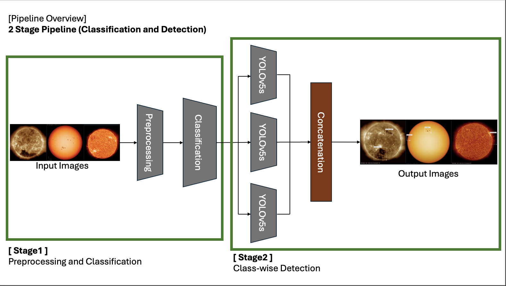
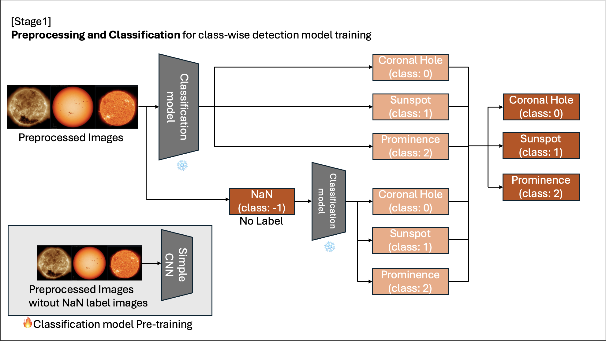
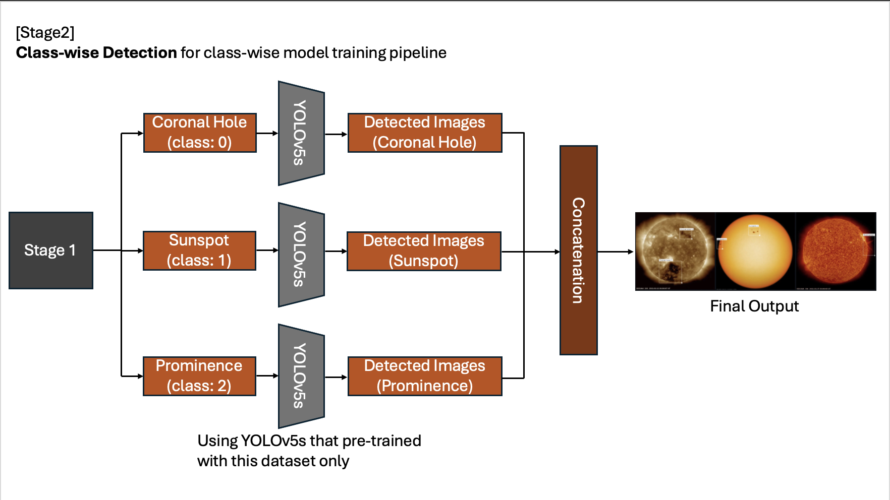

<br />
<br />

# ☀️[Total 1st 태양상 수상] 2024 제1회 한국천문연구원-카이스트 천문우주 AI 경진대회 (우쭈쭈팀)☀️
- "2024 제1회 한국천문연구원-카이스트 천문우주 AI 경진대회" 태양상 수상 🏆
    - 한국천문연구원 · 카이스트 SW교육센터 주관
    - "천문연, 천문우주AI 경진대회···1위 상명대, 2위 KAIST" (https://www.hellodd.com/news/articleView.html?idxno=105351)
<div align="center">
    
    
</div>
<br/>

## 1. Contest Overview
- 대회 주제: **"AI기반 지구 영향 태양 이벤트 자동화 탐지"**
    * 태양 코로나홀(coronal hole), 흑점(sunspot), 홍염(prominence) 탐지
<div align="center">
    
    
    
</div>

- 대회 기간: 2024.07. ~ 2024.08. (1개월)
<br/>

## 2. Team Members
Team: **"우쭈쭈팀"**
| 맹의현 | 신은빈 | 이창민 |
|:------:|:------:|:------:|
| [GitHub](https://github.com/maeng99) | [GitHub](https://github.com/) | [GitHub](https://github.com/LeeChangmin0310) |
<br/>

## 3. Preliminary
- 천문 · AI 퀴즈 + 천문 데이터 레이블링 스코어
    - 레이블링 예시
<div align="center">
    
    
    
</div>
<br />

## 4. Finals
- 인공지능 모델을 이용하여 태양 이미지의 레이블을 판별하고 위치를 탐지
    - 흑점, 코로나 홀, 홍염 3가지 유형의 이미지 제공
    - 각 이미지에는 각 탐지 대상에 대한 라벨링만 된 상태
- elice 플랫폼( https://kaist-kasiai.elice.io/explore )을 활용해 과제 수행
### 4.1 Evaluation Formula
- F1 Score
    - IoU 0.5
- Public 평가 데이터와 Private 평가 데이터 50:50으로 최종 채점
### 4.2 Fianl Results of The Evaluation
- Public: 0.884474 / Private: 0.884492 / Total: 0.884483

<br />
<br />

## 5. Key Points
### 5.1 Pipeline Construction

#### [ Overview ]


##### [ Stage 1 ]


#### [ Stage 2 ]


- 대회를 성공적으로 이끌었던 주요인
### 5.2 YOLO Models
- detection을 수행하는 과정에서 YOLOv5n부터 YOLOv10s에 이르기까지 다양한 model로 과제를 수행
- 의외로 YOLOv5s model이 가장 높은 달성률을 보임<br /> -> 아마 데이터가 엄청 방대하지 않고, 복잡한 형태가 아니기 때문이라고 생각...
### 5.3 Augmentation
- 여러 방식의 증강 기법 시도
- 각 태양 이벤트 별 이미지 형태가 비슷하다는 점과 태양 이벤트가 극점에서 주로 발생한다는 점을 고려하여,<br />상하 또는 좌우 Flip 기법을 채택하여 다양하게 적용
### 5.4 Image Size / Batch / Epoch
- 실험은 통한 최적의 HyperParameter 결정
- Image Size=1024 / Batch=64 / Epoch=70
<br />
<br />

## 6. Final Code
### 6.1 Classify Datasets by Solar Event
#### 6.1.1 Declare Library
```python
import json
import os
import shutil

import matplotlib.patches as patches
import matplotlib.pyplot as plt
import numpy as np
import pandas as pd
import yaml
from PIL import Image
from tqdm import tqdm

from sklearn.model_selection import train_test_split
from PIL import Image
import torch
from torch.utils.data import Dataset, DataLoader
from torchvision import transforms, models
import torch.nn as nn
import torch.optim as optim
```
#### 6.1.2 Define HyperParameters
```python
IMAGE_SIZE = 1024
BATCH = 64
EPOCH = 70
```
#### 6.1.3 Load Train Data
```python
train_data = []

for image in tqdm(os.listdir(os.path.join(DATASET_ROOT, TRAIN_DIR, IMAGE_DIR))):
    image_id = image.split(".")[0]
    image_path = os.path.join(DATASET_ROOT, TRAIN_DIR, IMAGE_DIR, image)
    label_path = os.path.join(DATASET_ROOT, TRAIN_DIR, LABELS_DIR, image_id + ".txt")
    labels = []
    if os.path.exists(label_path):
        with open(label_path, "r") as f:
            for line in f.readlines():
                class_id = int(line.split()[0])
                x = float(line.split()[1])
                y = float(line.split()[2])
                w = float(line.split()[3])
                h = float(line.split()[4])
                labels.append({"class_id": class_id, "x": x, "y": y, "w": w, "h": h})

    train_data.append({"id": image_id, "image_path": image_path, "label_path": label_path, "labels": labels})

df_train = pd.DataFrame(train_data)
df_train.head()
```
#### 6.1.4 Augmentation
```python
# 현재 작업 디렉토리에 증강 이미지를 저장하도록 설정
augmented_image_dir = os.path.join(os.getcwd(), "augmented_images")
augmented_label_dir = os.path.join(os.getcwd(), "augmented_labels")
os.makedirs(augmented_image_dir, exist_ok=True)
os.makedirs(augmented_label_dir, exist_ok=True)

# 이미지를 반전하고 라벨을 변환하는 함수
def flip_image_and_labels(image, labels, flip_type):
    if flip_type == 'tb':  # 상하 반전
        flipped_image = image.transpose(method=Image.FLIP_TOP_BOTTOM)
        flipped_labels = [{'class_id': label['class_id'], 'x': label['x'], 'y': 1 - label['y'], 'w': label['w'], 'h': label['h']} for label in labels]
    elif flip_type == 'lr':  # 좌우 반전
        flipped_image = image.transpose(method=Image.FLIP_LEFT_RIGHT)
        flipped_labels = [{'class_id': label['class_id'], 'x': 1 - label['x'], 'y': label['y'], 'w': label['w'], 'h': label['h']} for label in labels]
    elif flip_type == 'tb_lr':  # 상하 및 좌우 반전
        flipped_image = image.transpose(method=Image.FLIP_TOP_BOTTOM).transpose(method=Image.FLIP_LEFT_RIGHT)
        flipped_labels = [{'class_id': label['class_id'], 'x': 1 - label['x'], 'y': 1 - label['y'], 'w': label['w'], 'h': label['h']} for label in labels]
    else:
        flipped_image = image
        flipped_labels = labels
    
    return flipped_image, flipped_labels

# 반전된 이미지와 라벨을 저장하는 함수
def save_augmented_data(image_path, labels, output_image_path, output_label_path, flip_type):
    # 이미지 열기
    image = Image.open(image_path)
    
    # 이미지와 라벨을 반전
    flipped_image, flipped_labels = flip_image_and_labels(image, labels, flip_type)

    # 반전된 이미지 저장
    flipped_image.save(output_image_path)

    # 반전된 라벨 저장
    with open(output_label_path, 'w') as f:
        for label in flipped_labels:
            f.write(f"{label['class_id']} {label['x']} {label['y']} {label['w']} {label['h']}\n")

# 기존 데이터셋을 순회하며 증강
for i, row in tqdm(df_train.iterrows(), total=len(df_train)):
    image_id = row['id']
    image_path = row['image_path']
    label_path = row['label_path']

    # 원본 라벨 불러오기
    labels = []
    with open(label_path, 'r') as f:
        for line in f.readlines():
            class_id, x, y, w, h = map(float, line.strip().split())
            labels.append({'class_id': class_id, 'x': x, 'y': y, 'w': w, 'h': h})

    # 증강된 이미지와 라벨을 저장하기 위한 각 반전 타입별 파일명과 경로
    flip_types = ['', 'tb', 'lr']
    for flip_type in flip_types:
        new_image_id = f"{image_id}_aug_{flip_type}" if flip_type else f"{image_id}_aug"
        output_image_path = os.path.join(augmented_image_dir, f"{new_image_id}.jpg")
        output_label_path = os.path.join(augmented_label_dir, f"{new_image_id}.txt")

        # 증강 데이터 저장
        save_augmented_data(image_path, labels, output_image_path, output_label_path, flip_type)

        # 새로운 데이터프레임 행 추가
        new_row = pd.DataFrame([{
            'id': new_image_id,
            'image_path': output_image_path,
            'label_path': output_label_path,
            'labels': labels
        }])

        # 기존 데이터프레임에 증강된 데이터 추가
        df_train = pd.concat([df_train, new_row], ignore_index=True)
```
#### 6.1.5 Define "class" Column
- Define "class" column using 'class_id' of "labels" column
```python
df_train['class'] = df_train['labels'].apply(lambda x: [item['class_id'] for item in x] if x else [])
df_train['class'] = df_train['class'].apply(lambda x: int(x[0]) if x else None)
df_train['class'] = df_train['class'].apply(lambda x: int(x) if pd.notna(x) else -1)
df_train['class'].value_counts()
```
```
class
 0    20504
 2    16876
 1    16444
-1     5644
Name: count, dtype: int6
```
#### 6.1.6 Create "df_train_NaN" and "df_train_noneNaN" DataFrame
- Create image information without label as "df_train_NaN" dataFrame
- Create image information with label as "df_train_noneNaN" dataFrame
```python
df_train_noneNaN = df_train[df_train['class'] != -1]
df_train_NaN = df_train[df_train['class'] == -1]
```
#### 6.1.7 Define and Train CNN Model (Classification)
```python
image_size = (256, 256)
batch_size = 32
num_classes = df_train['class'].nunique()
device = torch.device("cuda" if torch.cuda.is_available() else "cpu")

# 이미지 전처리 설정
transform = transforms.Compose([
    transforms.Resize(image_size),
    transforms.ToTensor(),
])
```
```python
# CNN 모델 정의
class SimpleCNN(nn.Module):
    def __init__(self, num_classes):
        super(SimpleCNN, self).__init__()
        self.conv1 = nn.Conv2d(3, 32, kernel_size=3, padding=1)
        self.conv2 = nn.Conv2d(32, 64, kernel_size=3, padding=1)
        self.conv3 = nn.Conv2d(64, 128, kernel_size=3, padding=1)
        self.pool = nn.MaxPool2d(2, 2)
        self.fc1 = nn.Linear(128 * (image_size[0]//8) * (image_size[1]//8), 128)
        self.fc2 = nn.Linear(128, num_classes)
        self.dropout = nn.Dropout(0.5)

    def forward(self, x):
        x = self.pool(torch.relu(self.conv1(x)))
        x = self.pool(torch.relu(self.conv2(x)))
        x = self.pool(torch.relu(self.conv3(x)))
        x = x.view(-1, 128 * (image_size[0]//8) * (image_size[1]//8))
        x = torch.relu(self.fc1(x))
        x = self.dropout(x)
        x = self.fc2(x)
        return x
```
```python
# 커스텀 데이터셋 클래스 정의
class ImageDataset(Dataset):
    def __init__(self, df, transform=None):
        self.df = df
        self.transform = transform

    def __len__(self):
        return len(self.df)

    def __getitem__(self, idx):
        img_path = self.df.iloc[idx]['image_path']
        image = Image.open(img_path).convert('RGB')
        label = int(self.df.iloc[idx]['class'])

        if self.transform:
            image = self.transform(image)

        return image, label
```
```python
# 데이터셋 생성
train_df, valid_df = train_test_split(df_train_noneNaN, test_size=0.2, random_state=42)
train_dataset = ImageDataset(train_df, transform=transform)
valid_dataset = ImageDataset(valid_df, transform=transform)

# 데이터 로더 생성
train_loader = DataLoader(train_dataset, batch_size=batch_size, shuffle=True)
valid_loader = DataLoader(valid_dataset, batch_size=batch_size, shuffle=False)

# 모델 인스턴스 생성
model = SimpleCNN(num_classes=num_classes)

# 손실 함수와 옵티마이저 설정
criterion = nn.CrossEntropyLoss()
optimizer = optim.Adam(model.parameters(), lr=0.001)

# 학습 함수 정의
def train_model(model, train_loader, criterion, optimizer, num_epochs=10):
    model.train()
    for epoch in range(num_epochs):
        running_loss = 0.0
        for images, labels in train_loader:
            optimizer.zero_grad()
            outputs = model(images)
            loss = criterion(outputs, labels)
            loss.backward()
            optimizer.step()
            running_loss += loss.item()

        print(f'Epoch [{epoch+1}/{num_epochs}], Loss: {running_loss/len(train_loader):.4f}')

# 검증 함수 정의
def validate_model(model, valid_loader, criterion):
    model.eval()
    correct = 0
    total = 0
    with torch.no_grad():
        for images, labels in valid_loader:
            outputs = model(images)
            _, predicted = torch.max(outputs.data, 1)
            total += labels.size(0)
            correct += (predicted == labels).sum().item()

    print(f'Validation Accuracy: {100 * correct / total:.2f}%')
    
# 모델 학습
train_model(model, train_loader, criterion, optimizer, num_epochs=4)
# 모델 검증
validate_model(model, valid_loader, criterion)
# 모델 저장
torch.save(model.state_dict(), 'simple_cnn.pth')
```
#### 6.1.8 Classify "df_train_NaN" Datasets
- Classify image data without class using CNN model
```python
# 테스트 데이터셋 클래스 정의
class NaNDataset(Dataset):
    def __init__(self, df, transform=None):
        self.df = df
        self.transform = transform

    def __len__(self):
        return len(self.df)

    def __getitem__(self, idx):
        img_path = self.df.iloc[idx]['image_path']
        image = Image.open(img_path).convert('RGB')

        if self.transform:
            image = self.transform(image)

        return image

# 테스트 데이터셋 및 데이터 로더 생성
NaN_dataset = NaNDataset(df_train_NaN, transform=transform)
NaN_loader = DataLoader(NaN_dataset, batch_size=batch_size, shuffle=False)

# 예측 결과 저장
predictions_NaN = []

with torch.no_grad():
    for images in NaN_loader:
        outputs = model(images)
        _, predicted = torch.max(outputs.data, 1)
        predictions_NaN.extend(predicted.cpu().numpy())

# df_test에 예측 결과 추가
df_train_NaN['class'] = predictions_NaN
```
#### 6.1.9 Concat "df_train_NaN" and "df_train_noneNaN" DataFrame
```python
df_train = pd.concat([df_train_noneNaN,df_train_NaN]).sort_index()
```
---
### 6.2 Training Models for Each Solar Event
#### 6.2.0 Clone YOLOv5 Model
```python
!git clone https://github.com/ultralytics/yolov5.git 
!pip install --quiet -r yolov5/requirements.txt
```
#### 6.2.1 Coronal Hole: Split Data
- train data:valid data = 8:2
```python
df_train_coronalHole_set = df_train_coronalHole.sample(frac=0.8, random_state=0)
df_valid_coronalHole_set = df_train_coronalHole.drop(df_train_coronalHole_set.index)
```
#### 6.2.2 Coronal Hole: Data Preprocessing
- Resize the image and copy it to each folder
```python
for i, row in tqdm(df_train_coronalHole_set.iterrows(), total=len(df_train_coronalHole_set)):
    image = Image.open(row["image_path"])
    image.resize((IMAGE_SIZE, IMAGE_SIZE)).save(f"{new_train_coronalHole_path}/{IMAGE_DIR}/{row['id']}.jpg")
    shutil.copy(row["label_path"], f"{new_train_coronalHole_path}/{LABELS_DIR}/{row['id']}.txt")

for i, row in tqdm(df_valid_coronalHole_set.iterrows(), total=len(df_valid_coronalHole_set)):
    image = Image.open(row["image_path"])
    image.resize((IMAGE_SIZE, IMAGE_SIZE)).save(f"{new_valid_coronalHole_path}/{IMAGE_DIR}/{row['id']}.jpg")
    shutil.copy(row["label_path"], f"{new_valid_coronalHole_path}/{LABELS_DIR}/{row['id']}.txt")
```
#### 6.2.3 Coronal Hole: Train Model
```python
dataset = {
    "path": os.path.abspath("."),
    "train": "train_coronalHole",
    "val": "valid_coronalHole",
    "nc": 1,
    "names": ["coronal_hole"],
}

YAML_PATH = os.path.abspath("coronalHole.yaml")
RESULT_PATH = os.path.abspath("result6_coronalHole")
os.makedirs(RESULT_PATH, exist_ok=True)

with open(YAML_PATH, "w") as f:
    yaml.dump(dataset, f)
```
```python
!PYTHONWARNINGS="ignore::FutureWarning" python yolov5/train.py --img {IMAGE_SIZE} --batch {BATCH} --epoch {EPOCH} --data {YAML_PATH} --cfg yolov5s.yaml --exist-ok --weights "" --name coronalHole --project {RESULT_PATH}
```
```
      Epoch    GPU_mem   box_loss   obj_loss   cls_loss  Instances       Size
       0/69      32.8G    0.07525    0.04406          0        217       1024: 1
                 Class     Images  Instances          P          R      mAP50   
                   all       5920      12660      0.122      0.138      0.048     0.0104

      Epoch    GPU_mem   box_loss   obj_loss   cls_loss  Instances       Size
       1/69      29.2G    0.05207    0.03072          0        199       1024: 1
                 Class     Images  Instances          P          R      mAP50   
                   all       5920      12660      0.664      0.707      0.696      0.338

      Epoch    GPU_mem   box_loss   obj_loss   cls_loss  Instances       Size
       2/69      29.2G    0.04162    0.02532          0        175       1024: 1
                 Class     Images  Instances          P          R      mAP50   
                   all       5920      12660      0.605      0.519      0.525      0.173

      Epoch    GPU_mem   box_loss   obj_loss   cls_loss  Instances       Size
       3/69      29.2G    0.03505    0.02265          0        184       1024: 1
                 Class     Images  Instances          P          R      mAP50   
                   all       5920      12660      0.854      0.852      0.915        0.6

    ...

      Epoch    GPU_mem   box_loss   obj_loss   cls_loss  Instances       Size
      66/69      32.7G     0.0193    0.01447          0        191       1024: 1
                 Class     Images  Instances          P          R      mAP50   
                   all       5920      12660      0.963      0.974      0.991      0.829

      Epoch    GPU_mem   box_loss   obj_loss   cls_loss  Instances       Size
      67/69      32.7G    0.01916    0.01411          0        169       1024: 1
                 Class     Images  Instances          P          R      mAP50   
                   all       5920      12660      0.963      0.975      0.991       0.83

      Epoch    GPU_mem   box_loss   obj_loss   cls_loss  Instances       Size
      68/69      32.7G    0.01904    0.01414          0        190       1024: 1
                 Class     Images  Instances          P          R      mAP50   
                   all       5920      12660      0.963      0.975      0.991      0.831

      Epoch    GPU_mem   box_loss   obj_loss   cls_loss  Instances       Size
      69/69      32.7G    0.01891    0.01406          0        223       1024: 1
                 Class     Images  Instances          P          R      mAP50   
                   all       5920      12660      0.964      0.975      0.991      0.832

YOLOv5s summary: 157 layers, 7012822 parameters, 0 gradients, 15.8 GFLOPs
                 Class     Images  Instances          P          R      mAP50   
                   all       5920      12660      0.964      0.975      0.991      0.832
```
#### 6.2.4 Coronal Hole: Validate Model
```python
!python yolov5/detect.py --source {os.path.join(new_valid_coronalHole_path, IMAGE_DIR)} --weights {RESULT_PATH}/coronalHole/weights/best.pt --conf 0.5 --save-txt --save-conf --exist-ok --project {RESULT_PATH}/valid
```
- Visualize predictions (r: predictions, w: labels)


#### 6.2.5 Repeat This Training Process Equally for Sunspots and Prominence
...
<br />


---
### 6.3 Inference
#### 6.3.1 Load Test Data
```python
test_data = []

for image in tqdm(os.listdir(os.path.join(DATASET_ROOT, TEST_DIR, IMAGE_DIR))):
    image_id = image.split(".")[0]
    image_path = os.path.join(DATASET_ROOT, TEST_DIR, IMAGE_DIR, image)

    # 테스트 데이터는 라벨 파일이 없습니다.
    test_data.append({"id": image_id, "image_path": image_path, "label_path": "", "labels": []})

df_test = pd.DataFrame(test_data)
```
#### 6.3.2 Classify Test Data
- Classify to use the CNN model trained earlier
```python
# 테스트 데이터셋 클래스 정의
class TestDataset(Dataset):
    def __init__(self, df, transform=None):
        self.df = df
        self.transform = transform

    def __len__(self):
        return len(self.df)

    def __getitem__(self, idx):
        img_path = self.df.iloc[idx]['image_path']
        image = Image.open(img_path).convert('RGB')

        if self.transform:
            image = self.transform(image)

        return image

# 테스트 데이터셋 및 데이터 로더 생성
test_dataset = TestDataset(df_test, transform=transform)
test_loader = DataLoader(test_dataset, batch_size=batch_size, shuffle=False)

# 예측 결과 저장
predictions_test = []

with torch.no_grad():
    for images in test_loader:
        outputs = model(images)
        _, predicted = torch.max(outputs.data, 1)
        predictions_test.extend(predicted.cpu().numpy())

# df_test에 예측 결과 추가
df_test['class'] = predictions_test
```
```python
df_test_coronalHole = df_test[df_test['class'] == 0]
df_test_sunspot = df_test[df_test['class'] == 1]
df_test_prominence = df_test[df_test['class'] == 2]
```
#### 6.3.3 Infer for Each Solar Event
- Preprocessing
```python
for i, row in tqdm(df_test_coronalHole.iterrows(), total=len(df_test_coronalHole)):
    image = Image.open(row["image_path"])
    image.resize((IMAGE_SIZE, IMAGE_SIZE)).save(f"{new_test_coronalHole_path}/{IMAGE_DIR}/{row['id']}.jpg")
```
- Test
```python
!python yolov5/detect.py --source {os.path.join(new_test_coronalHole_path, IMAGE_DIR)} --weights result6_coronalHole/coronalHole/weights/best.pt --conf 0.5 --save-txt --save-conf --exist-ok --project result6_coronalHole/test
```
- Create label
```python
for i, row in tqdm(df_test_coronalHole.iterrows(), total=len(df_test_coronalHole)):
    label_path = os.path.join("result6_coronalHole", "test", "exp", "labels", row["id"] + ".txt")

    labels = []
    if os.path.exists(label_path):
        with open(label_path, "r") as f:
            lines = f.readlines()

        for line in lines:
            class_id, c_x, c_y, w, h, conf = map(float, line.split())
            labels.append({"class_id": int(class_id), "conf": conf, "x": c_x, "y": c_y, "w": w, "h": h})

    df_test_coronalHole.at[i, "labels"] = labels
df_test_coronalHole
```


- Repeat This Inference Process Equally for Sunspots and Prominence<br />...
#### 6.3.4 Combine Test Data
```python
df_test = pd.concat([df_test_coronalHole,df_test_sunspot,df_test_prominence]).sort_index()
df_test = df_test.drop('class', axis=1)
df_test.head()
```
#### 6.3.5 Create Submission File
```python
submission = []

for i, row in tqdm(df_test.iterrows(), total=len(df_test)):
    image_id = row["id"]
    labels = []
    for label in row["labels"]:
        class_id = label["class_id"]
        x = label["x"]
        y = label["y"]
        w = label["w"]
        h = label["h"]

        labels.append({"class_id": class_id, "x": x, "y": y, "w": w, "h": h})
    submission.append({"id": image_id, "labels": labels})

df_submission = pd.DataFrame(submission)
df_submission.to_csv("submission.csv", index=False)
```
